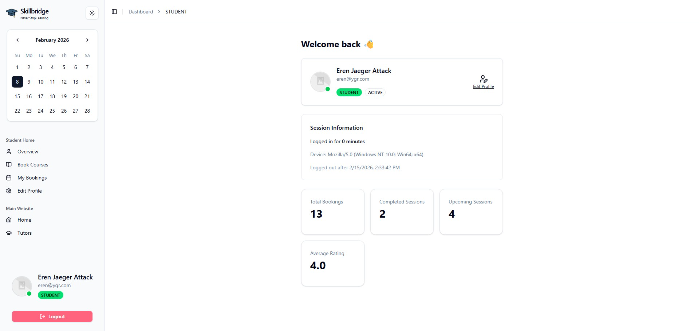

# SkillBridge Frontend 🎓

**SkillBridge** is a full-stack tutoring platform where students can discover expert tutors, book lesson slots, and pay securely via Stripe. This repository contains the **Next.js frontend** powering the user interface.

🔗 **Live Site:** [https://skillbridge-frontend-plum.vercel.app](https://skillbridge-frontend-plum.vercel.app)
🔗 **Backend Repo:** [skillbridge-backend](https://github.com/Rezwan66/skillbridge-backend)

---

## 🛠️ Tech Stack

| Layer            | Technology                                                    |
| ---------------- | ------------------------------------------------------------- |
| Framework        | Next.js 16 (App Router)                                      |
| Language         | TypeScript                                                    |
| Styling          | Tailwind CSS v4                                               |
| UI Components    | shadcn/ui (Radix UI primitives)                               |
| Forms            | TanStack React Form + Zod v4 validation                       |
| Authentication   | Better Auth (client SDK with session cookies)                 |
| State/Fetching   | Next.js Server Actions + Server Components                    |
| Notifications    | Sonner (toasts) + SweetAlert2 (modals)                        |
| Carousel         | Embla Carousel                                                |
| Theming          | next-themes (light/dark mode)                                 |
| Runtime          | Bun                                                           |
| Deployment       | Vercel                                                        |

---

## 📸 Screenshots

### Homepage


### Student Dashboard



---

## ✨ Key Features

- **Public Tutor Discovery** — Browse, search, and filter tutors by name, category, rating, and hourly rate with a sticky sidebar filter panel.
- **Role-Based Dashboards** — Three parallel dashboard layouts using Next.js parallel routes: `@student`, `@tutor`, and `@admin`, each with tailored views.
- **Booking System** — Students browse tutor availability and book time slots with confirmation modals and real-time status updates.
- **Stripe Checkout** — Seamless payment flow with redirect to Stripe Checkout (EUR) and a dedicated payment success page with transaction details.
- **Edge Middleware Auth** — Server-side route protection that validates sessions and enforces role-based access before pages load.
- **Redirect Chain Preservation** — Login/Register flows preserve the user's intended destination across authentication steps (including the register → login → destination chain).
- **Dark Mode** — Full light/dark theme toggle powered by `next-themes`.
- **Responsive Design** — Fully responsive layout with a collapsible sidebar, mobile sheet navigation, and adaptive grid layouts.
- **Micro-Animations** — Premium hover effects on tutor cards (lift + image zoom), smooth transitions, and interactive filter states.

---

## 📁 Project Structure

```
src/
├── app/
│   ├── (auth)/                 # Login & Register pages
│   │   ├── login/
│   │   └── register/
│   ├── (public)/               # Public pages (homepage, tutors, tutor details)
│   │   ├── page.tsx            # Homepage
│   │   └── tutors/
│   ├── (dashboard)/            # Protected dashboard (parallel routes)
│   │   ├── @admin/             # Admin dashboard views
│   │   ├── @student/           # Student dashboard views
│   │   ├── @tutor/             # Tutor dashboard views
│   │   └── layout.tsx          # Shared sidebar layout
│   ├── globals.css
│   ├── layout.tsx              # Root layout (fonts, providers, metadata)
│   └── not-found.tsx           # Custom 404 page
├── actions/                    # Next.js Server Actions
├── components/
│   ├── layout/                 # App sidebar, navbar, footer, mode toggle
│   ├── modules/                # Feature-specific components
│   │   ├── authentication/     # Login/Register forms
│   │   ├── dashboard/          # Dashboard components (per-role)
│   │   ├── home/               # Homepage sections (hero, featured, marquee)
│   │   ├── shared/             # Shared components (profile card, logo)
│   │   └── tutors/             # Tutor cards, filters, grid
│   └── ui/                     # shadcn/ui primitives
├── constants/                  # Role enums, booking statuses
├── hooks/                      # Custom React hooks
├── lib/                        # Auth client, utilities
├── middleware.ts               # Edge middleware (route protection)
├── providers/                  # Theme & context providers
├── routes/                     # Role-based route definitions
├── services/                   # API service layer (tutor, booking, payment, etc.)
└── types/                      # TypeScript type definitions
```

---

## 🗺️ Page Routes

### Public Routes

| Route              | Description                                    |
| ------------------ | ---------------------------------------------- |
| `/`                | Homepage with featured tutors and testimonials |
| `/tutors`          | Tutor directory with search and filters        |
| `/tutors/:id`      | Individual tutor profile with availabilities   |
| `/login`           | User login                                     |
| `/register`        | User registration                              |

### Protected Dashboard Routes

| Route                                    | Role    | Description                          |
| ---------------------------------------- | ------- | ------------------------------------ |
| `/dashboard`                             | All     | Role-specific overview               |
| `/dashboard/edit-profile`                | All     | Edit user profile                    |
| `/dashboard/bookings`                    | All     | View bookings (role-filtered)        |
| `/dashboard/create-booking`              | Student | Book a tutor's availability slot     |
| `/dashboard/payment/payment-success`     | Student | Post-payment confirmation page       |
| `/dashboard/tutor-profile`               | Tutor   | Manage tutor profile                 |
| `/dashboard/teaching-categories`         | Tutor   | Manage teaching categories           |
| `/dashboard/availability`                | Tutor   | Create/delete availability slots     |
| `/dashboard/manage-tutors`               | Admin   | Manage all tutors on the platform    |
| `/dashboard/manage-users`                | Admin   | Manage all users (ban, role change)  |
| `/dashboard/manage-categories`           | Admin   | CRUD for teaching categories         |

---

## ✅ Getting Started

### Prerequisites

- Node.js v20+ (or Bun)
- A running [skillbridge-backend](https://github.com/Rezwan66/skillbridge-backend) instance

### 1. Clone & Install

```bash
git clone https://github.com/Rezwan66/skillbridge-frontend.git
cd skillbridge-frontend
npm install
```

### 2. Configure Environment Variables

Create a `.env` file in the project root:

```env
# Backend API
API_URL=http://localhost:5000
# API_URL=https://skillbridge-backend-phi.vercel.app

# Auth endpoint
AUTH_URL=http://localhost:5000/api/auth
# AUTH_URL=https://skillbridge-backend-phi.vercel.app/api/auth

# Public URLs (accessible in client components)
NEXT_PUBLIC_BACKEND_URL=http://localhost:5000
# NEXT_PUBLIC_BACKEND_URL=https://skillbridge-backend-phi.vercel.app
NEXT_PUBLIC_FRONTEND=http://localhost:3000
```

### 3. Run the Development Server

```bash
npm run dev
```

The app will start at `http://localhost:3000`.

---

## 🧪 Useful Commands

| Command           | Description                              |
| ----------------- | ---------------------------------------- |
| `npm run dev`     | Start development server with hot reload |
| `npm run build`   | Build for production                     |
| `npm run start`   | Start production server                  |
| `npm run lint`    | Run ESLint                               |

---

## 🔐 Authentication Flow

1. Users register with **name, email, password, and role** (Student or Tutor).
2. Login creates a session cookie via Better Auth.
3. **Edge Middleware** intercepts all `/dashboard/*` routes, validates the session against the backend, and enforces role-based access.
4. Protected route redirects preserve the intended destination through `?redirectPath=` query parameters — even across the Register → Login chain.

---

## 🚀 Deployment

Deploy to [Vercel](https://vercel.com) with zero configuration:

1. Push to GitHub
2. Import into Vercel
3. Set environment variables (point `API_URL` and `AUTH_URL` to your deployed backend)
4. Deploy

Check out the [Next.js deployment docs](https://nextjs.org/docs/app/building-your-application/deploying) for more details.
